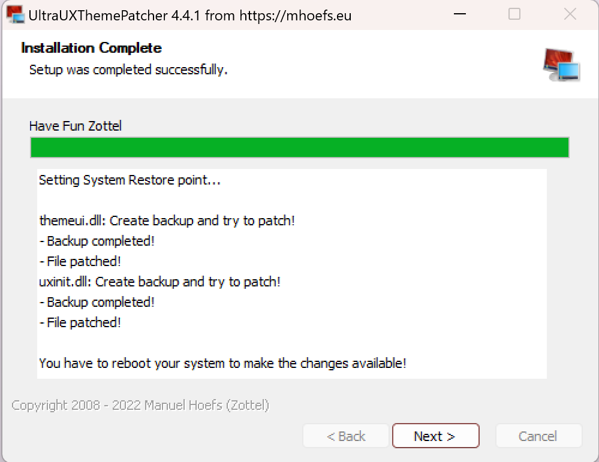
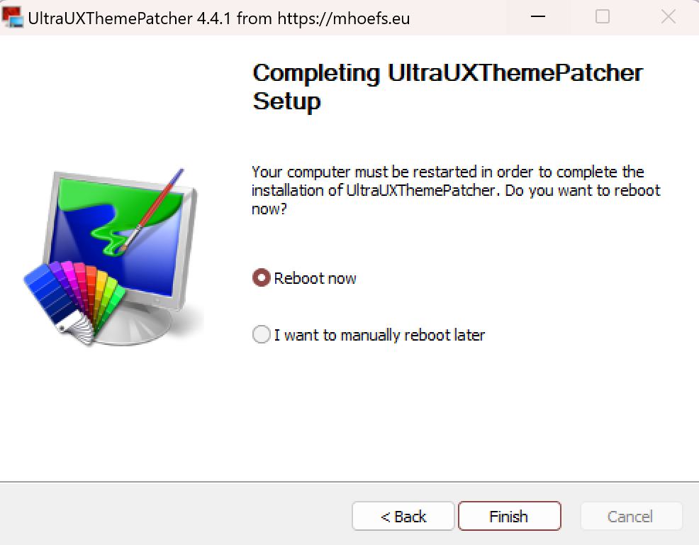
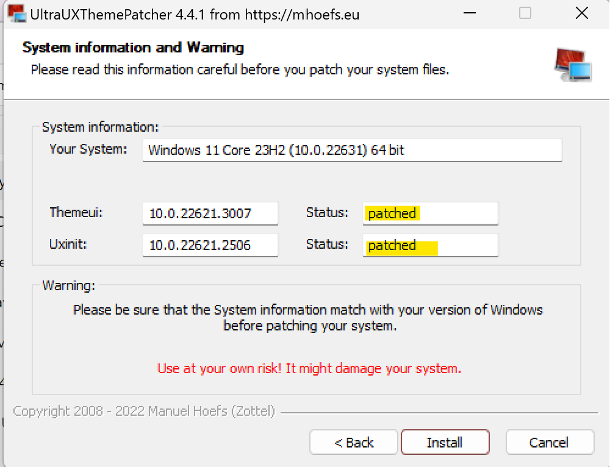
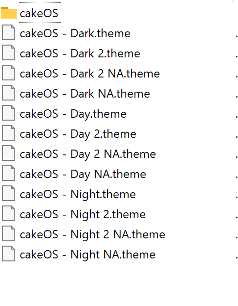
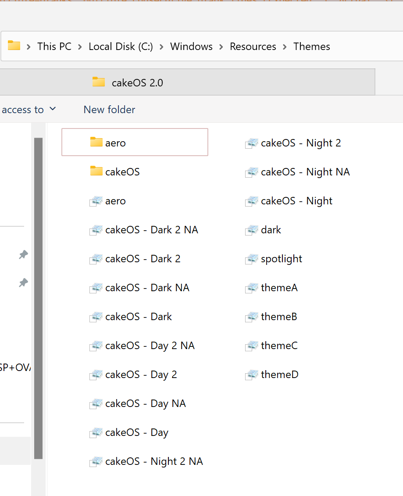
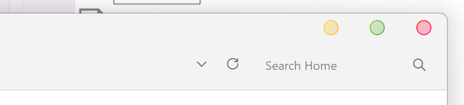
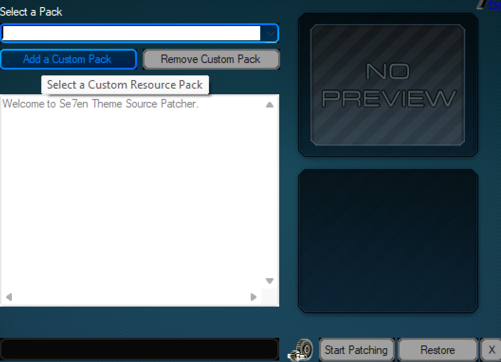
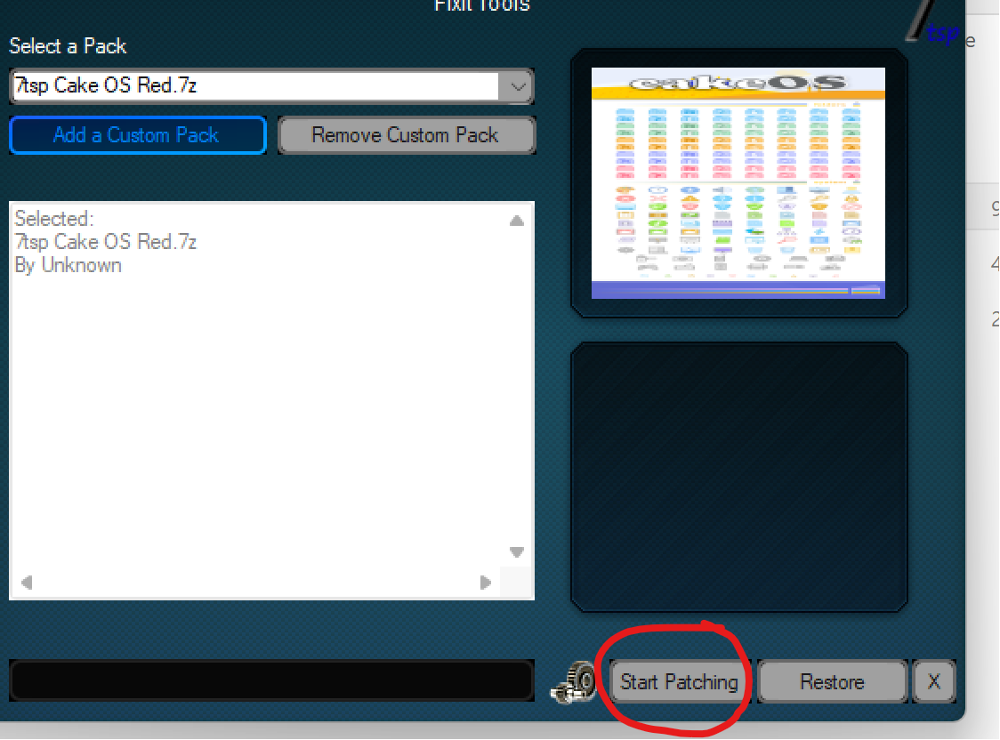
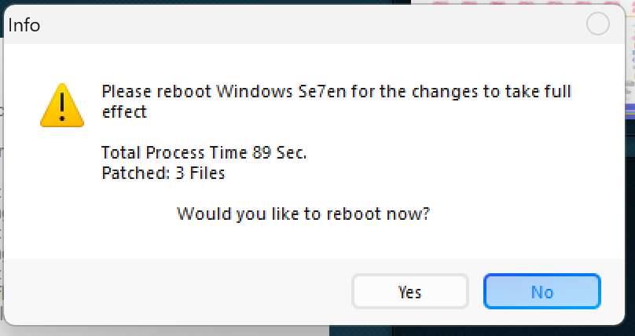

# How to make a cute desktop with Hello Kitty

Requirements:

- Hello Kitty wallpaper
- UltraUXThemePatcher
- Take Ownership Registry Hack
- 7TSP GUI
- Cake OS 2.0 theme

## Install

### Install UltraUXThemePatcher

Apply `Add Take Ownership to Context Menu.reg` by double clicking it.

Navigate to `C:\Windows\System32` and take ownership of the following files `themeui.dll` and `uxinit.dll`. To do that, right click on the file and select `Take Ownership`. If `Take Ownership` is not available, restart your computer and try again. If it still not available, it means that the registry hack was not applied correctly. This step is necessary in order to let UltraUXThemePatcher replace the files.

Install UltraUXThemePatcher. During the installation, select the option to patch the files `themeui.dll` and `uxinit.dll`. Verify that the files `themeui.dll` and `uxinit.dll` are patched as shown in the image below:

To complete the installation, restart your computer.

Run UltraUXThemePatcher again and verify that the files are `patched`. If they are not patched, try to patch them again. If they are already patched, you can close the program. The following image shows the successful patched status of the files:

Extract the contents the cakeOS 2.0 theme to `C:\Windows\Resources\Themes`. The folder `cakeOS 2.0` should be in the same directory as `Aero`. The files needed to be extracted are shown in the image below:

When the files are extracted, the folder `C:\Windows\Resources\Themes` should look like this:

Double click on the file `cakeOS - Day.theme` to apply the theme. As a result, windows will change to the cakeOS theme, and the window title bars will look like the image below:

### Install 7TSP GUI

Extract 7tsp_gui_2019_edition_by_devillnside_ddb5026 to a folder. Run the file `7tsp_gui_2019_edition_by_devillnside_ddb5026.exe` as administrator. Click on `Add a Custom Pack` and select the file `7tsp Cake OS Red` and click on `Start Patching`.

Patching may take a few minutes. Once the patching is complete, restart your computer.

### Optional tweaks

To make file explorer minimalistic, I use the following tweaks:

- Remove Home from navigation pane in File Explorer
- Remove Gallery from navigation pane in File Explorer for all users
- Hide OneDrive From File Explorer

To apply these tweaks, run the registry files `Remove Home from navigation pane in File Explorer.reg`, `Remove Gallery from navigation pane in File Explorer for all users.reg` and `Hide OneDrive From File Explorer.reg` and merge them. Restart your computer to apply the changes.